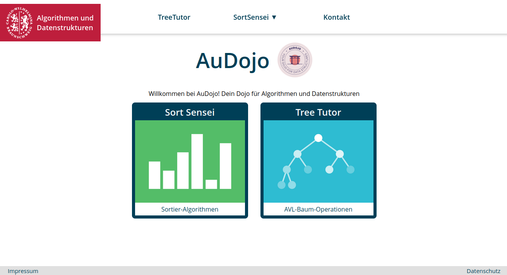
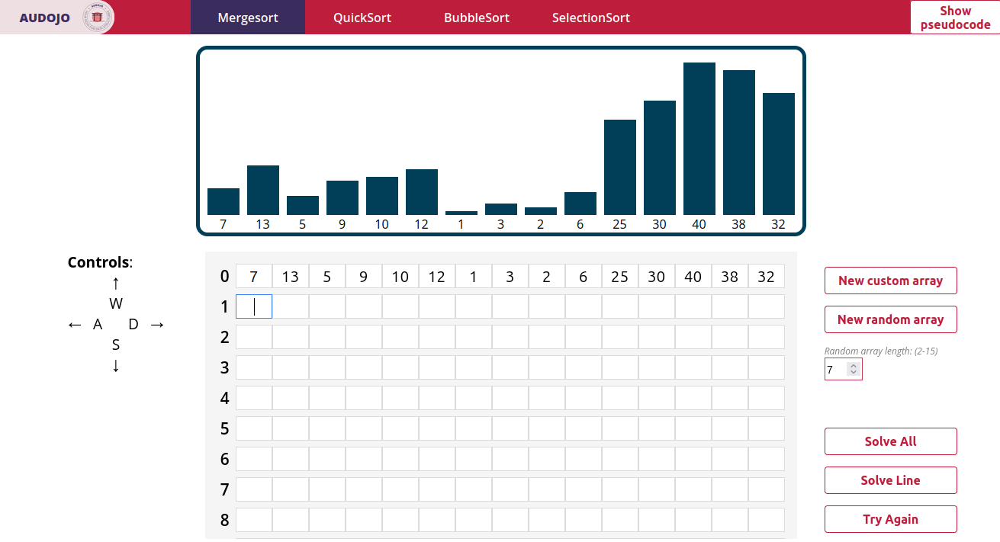

# AuDojo ⛩️

- AVL-Bäume und Sortieralgorithmen selbstständig üben und verstehen 📚
- Interaktive Website mit Schritt-für-Schritt-Lernen und direktem Feedback ✅
- Spielerisches Üben für mehr Verständnis und Selbstvertrauen 💪

<table style="">
  <tr>
    <th>Homepage</th>
    <th>SortSensei</th>
  </tr>
  <tr>
    <td>
      
    </td>
    <td>
      
    </td>
  </tr>
</table>

> *Hint: `git commit` will automatically check linting with ESLint and Prettier. `git commit --no-verify` will skip that.*

## Run AuDojo locally ⚡

### Installation 💾

```bash
npm i
```

### Run in Devmode 🥽

```bash
npm run dev # catch site-url from programm output
```

### Build 🏗️ && Run 🏃🏻

```bash
npm run build # remove artifacts with `npm run clean`
npm run start 
```

Das Dojo ist nun unter http://localhost:5001/ erreichbar ☎️

## Run AuDoJo in a Docker Container 🐋📦

### Via docker-compose

```bash
# Run
docker-compose up -d

# Stop and delete container
docker-compose down
```

### Via dockerfile 

(1) Image erzeugen 🌱

```bash
docker build -t audojo .
```

(2) Container starten 🛫

```bash
docker run -p 5001:5001 audojo
```

(3) Laufende Container anzeigen 👓

```bash
docker ps
```

(4) Auf Container zugreifen 🤚

```bash
docker exec -it <container_name> /bin/bash
```

(5) Container löschen 🗑️

```bash
docker rm <container_name>
```

(6) Images anzeigen 👓

```bash
docker image ls
```

(7) Images löschen 🗑️

```bash
docker rmi <image_name>
```

## ✨ Kriterien ✨

### 🔥 Muss

- 🐳 Docker-Unterstützung
- ✅ Tests für Stabilität
- 🌳 TreeTutor: Übungstool für AVL-Bäume
- 🔄 SortSensei: Sortieralgorithmen trainieren
- 🎮 Single-Player-Modus
- 🎲 Zufällig generierte Trees und Arrays
- 📖 Verlinkung auf AuD-Anleitungen
- 📜 Einsehen von Pseudo-Code der Algorithmen

### 💡 Soll

- ⭐ Punktesystem für mehr Motivation
- ⚔️ Battles:
  1v1
  Team vs. Team
- 🏆 Leaderboard für den Wettbewerb
- 📚 Generierte Anleitungen zur Hilfe

### 🌟 Kann

- 🤖 Chat-Bot-Helfer für Unterstützung
- 🔍 Übungen zur Breiten- und Tiefensuche
- 🧑‍💼 Benutzerkonten erstellen
- 📚 Battle in der Vorlesung für ein interaktives Lernerlebnis
- 🧩 AuD2: Üben von dynamischer Programmierung
- 📜 Story-Mode für eine immersive Lernerfahrung
